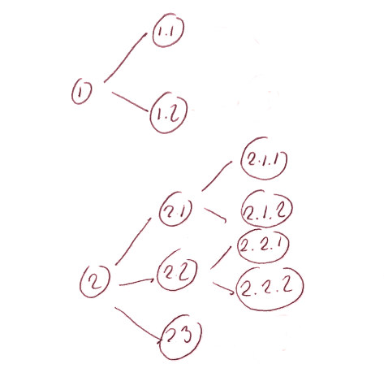
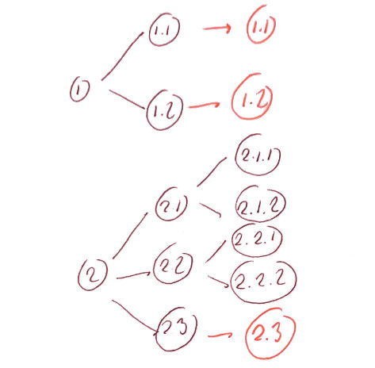

```{r setup, include=FALSE}
knitr::opts_chunk$set(echo = TRUE)
```


## Example classification: business actvity (NACE)

```{r, message=FALSE}
library(dplyr)
library(categorical)
data("nace_rev2")
print(nace_rev2, short = TRUE)
```

## Example 

```{r, echo=FALSE}
df <- data.frame(
  id = 1:200,
  activity = sample(nace_rev2[[4]]$id, 200),
  some_number = runif(200),
  stringsAsFactors = FALSE
)
```

```{r}
print(head(df))
```

```{r}
table(cast_level(df$activity, nace_rev2, level = 1, label = FALSE))
```

## Add classication to variable

```{r}
df$activity <- as_categorical(df$activity, classification = nace_rev2)
```

```{r}
table(cast_level(df$activity, level = 1, label = FALSE)) 
```


## Example of use within dplyr

```{r}
df %>% 
  filter(cast_level(activity, level = 1, label = F) == "A") %>%
  group_by(activity = cast_level(activity, level = 3)) %>%
  summarise(some_total = sum(some_number))
```

## complete_classification



## complete_classification




